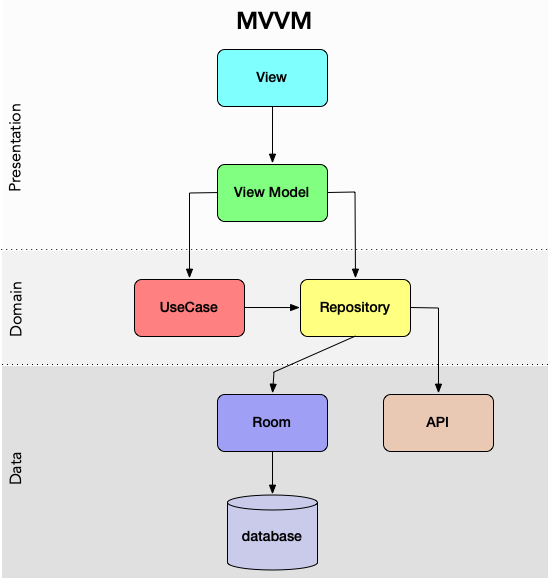

# camp-gladiator 

## Dev Setup

Project created using [Android Studio](https://developer.android.com/studio/index.html)

Checkout Project from [Camp Gladiator](https://github.com/mlemley/camp-gladiator)

### Google Map Api Access

In order for google maps to work follow the steps to [obtain an API token](https://developers.google.com/maps/documentation/android-sdk/get-api-key) for usage of the google map platform

Ensure the following:
1) [Map Api Support is enabled](https://console.cloud.google.com/apis/library/maps-android-backend.googleapis.com)
1) [Map GeoCode Api is enabled](https://console.cloud.google.com/marketplace/details/google/geocoding-backend.googleapis.com)
2) [Api Key has been created](https://console.cloud.google.com/apis/credentials)
3) [Downloaded SDK Tools](https://developer.android.com/studio/intro/update.html#sdk-manager)

Update either the local gradle.properties or the global gradle.properties located in `$HOME/.gradle/gradle.properties` 
to contain the following values for the development and production API keys.  If a `gradle.properties` does not exist 
in `$HOME/.gradle/` directory you can create the file and add the keys

```gradle.properties

GOOGLE_API_KEY={$production.key}

GOOGLE_API_KEY_DEBUG={$debug.key}
```

Note: If the following exception is reported in `Logcat` perform the following

```jshelllanguage
2020-02-15 17:02:03.717 12689-12798/app.camp.gladiator.debug E/Google Maps Android API: In the Google Developer Console (https://console.developers.google.com)
    Ensure that the "Google Maps Android API v2" is enabled.
    Ensure that the following Android Key exists:
    	API Key: $googleApiKey
    	Android Application (<cert_fingerprint>;<package_name>): 71:B4:3C:22:E1:55:8F:5E:AA:6A:85:79:51:9C:31:72:B3:49:FB:D3;app.camp.gladiator.debug
```

1) Navigate to your Map API Key
2) Edit the credentials in app to restrict usage to your application Add the fingerprint for the certificate as well as the package name of the application

### Gradle Configuration

### Local Build

Developers can build on the command line with the appropriate android environment


**Robolectric / Unit Test Execution**

```sh

  ./gradlew lintRelease testReleaseUnitTest

```

**Artifact Generation**

```sh

  ./gradlew clean assemble

```

Artifacts will be located at `$project.dir`/app/build/outputs/debug/`**`.apk


## CI / CD

Continuous Integration is brought to you by [Travis CI](https://travis-ci.org/mlemley/camp-gladiator)


## System Architecture

Implementing MVVM



## Tooling

### Test Frameworks Employed
* [Robolectric.org](https://robolectric.org) for integration / unit tests that touch the android framework
* [mockk](https://mockk.io/) for plain unit testing (Native Kotlin mocking DSL)

